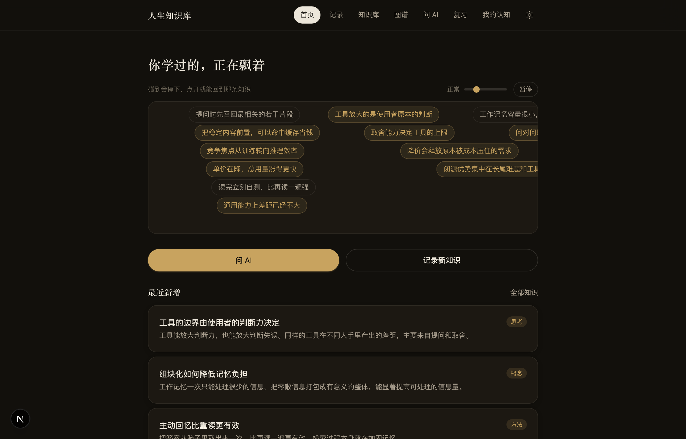
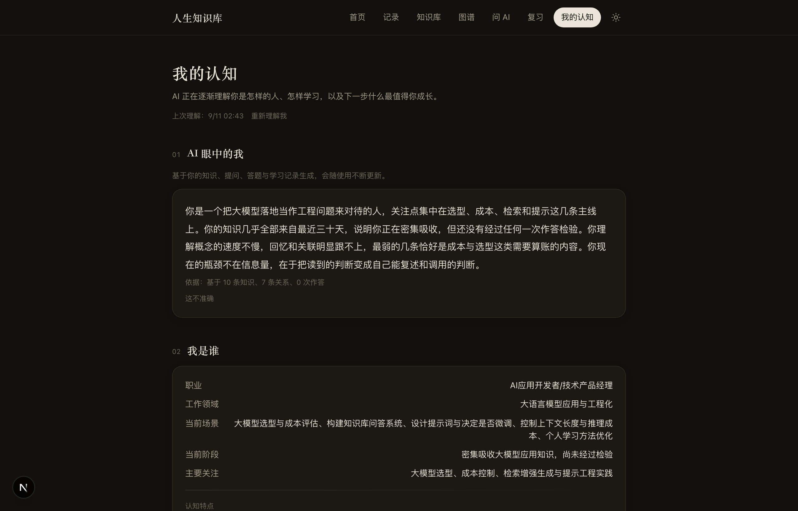
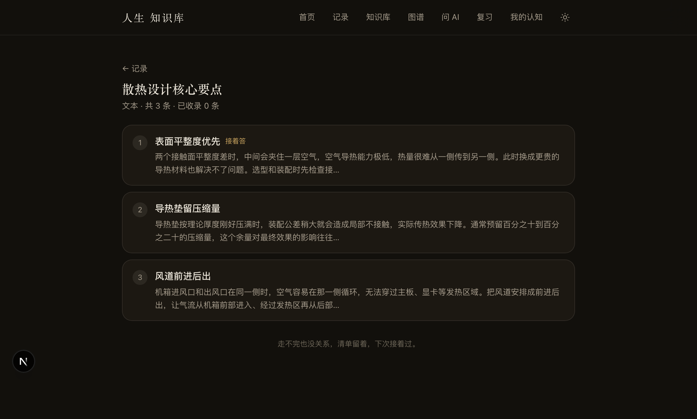
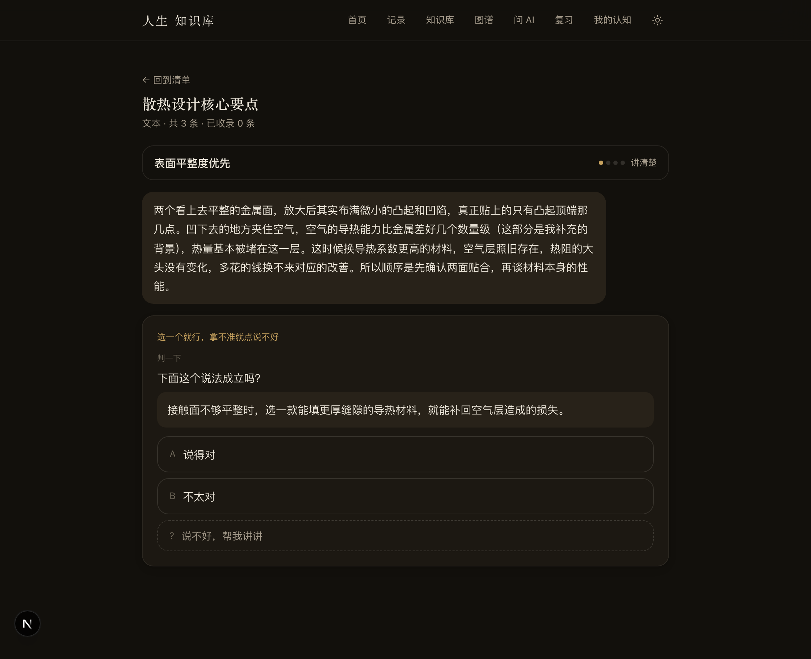
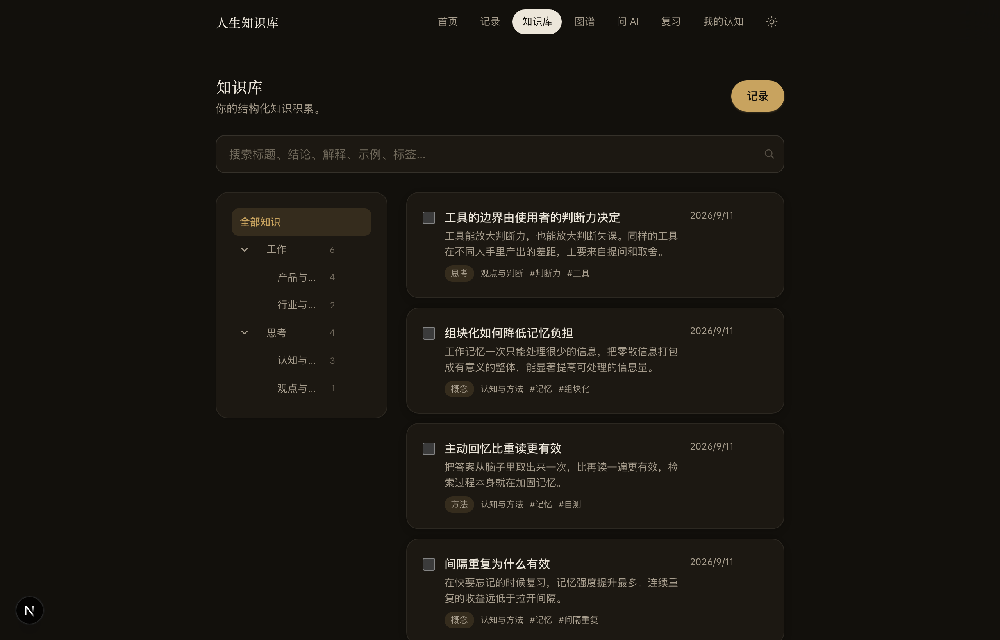
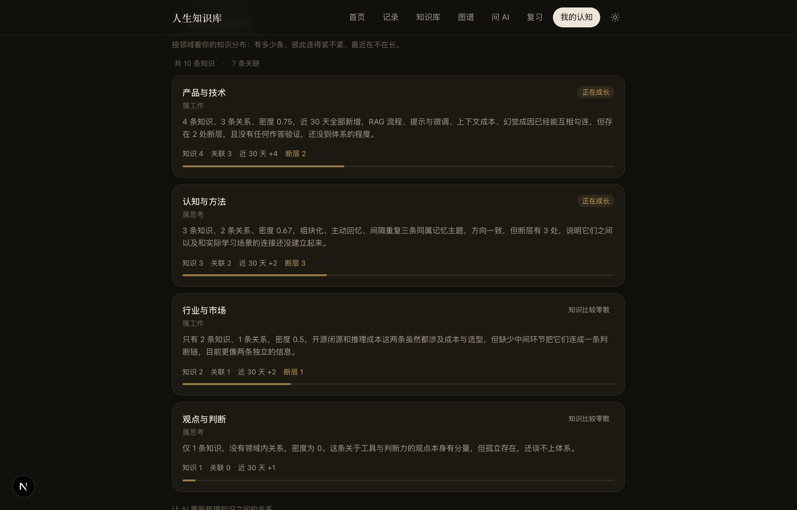
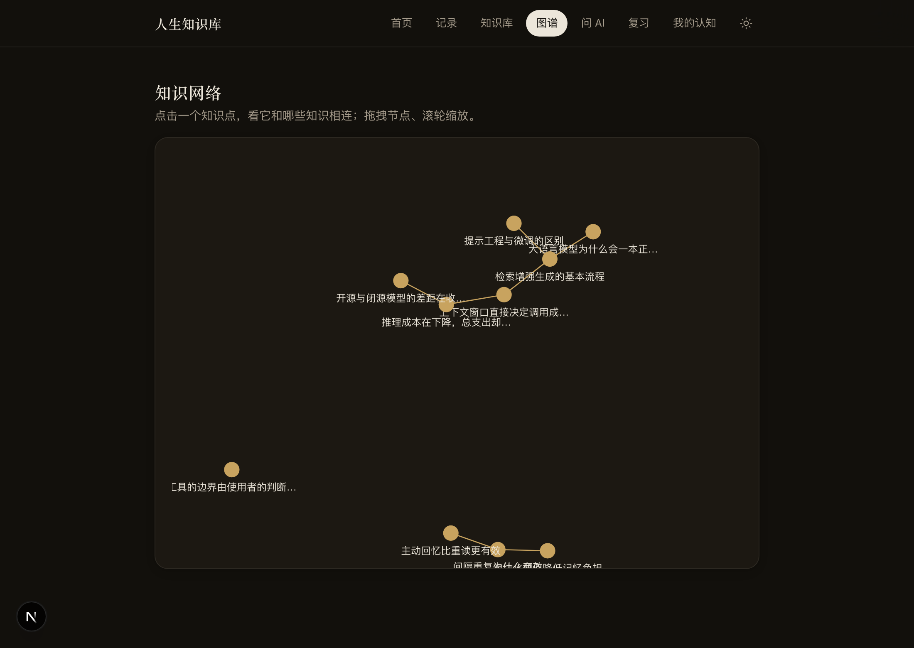

# 人生知识库

> **An AI coach that cares less about what you saved, and more about what you actually understand.**
> 一个不太在意你存了多少，更在意你到底懂没懂的 AI 知识教练。

收藏夹里躺着几百篇好文章，读完那一刻觉得自己懂了。三个月后别人问起，只剩一个模糊印象。问题出在「存下来」和「学会」之间那道缝：笔记软件负责存好，检索问答负责给答案，两边都不负责同一件事，你到底有没有真的掌握。

人生知识库盯着这道缝。你把内容丢给它，它跟你讨论到你真的讲得清楚才收下；收下之后替你归类、建立关联；过一段时间它来考你，答不好就把复习间隔缩短；哪天你突然想起一个念头，问它一句，它从你自己学过的东西里翻答案，顺便告诉你哪块其实是空的。

**知识库里每一条，都是你真正理解过的东西。** 这是它和收藏夹的全部区别。



---

## 目录

- [它不是什么](#它不是什么)
- [核心能力](#核心能力)
- [界面](#界面)
- [产品原则](#产品原则)
- [技术架构](#技术架构)
- [工程上值得一说的五处](#工程上值得一说的五处)
- [目录结构](#目录结构)
- [本地运行](#本地运行)
- [设计文档](#设计文档)

---

## 它不是什么

| | 说明 |
| --- | --- |
| 不是笔记软件 | 笔记软件的终点是「记下来了」，这里的起点才是 |
| 不是收藏夹 | 收藏不需要理解，这里进门要过一道理解的门槛 |
| 不是文档问答 | 文档问答给你答案，正确答案不负责让你会 |
| 不是刷题工具 | 出题是为了找薄弱点，为了看清你现在站在哪 |

它也不记录任何与你无关的内容。所有能力的输入只有一件事：你学过什么、学到哪一步。

---

## 核心能力

### 一、知识怎么进来

**材料随手丢进来。** 刷到的长文、别人发来的笔记、一张信息密集的截图、一份 PDF，直接丢进来就行。图片先被读懂，文档先被解析，然后拆成一份知识清单。一份材料里通常装着好几个独立的知识点，一次只聊一个，聊透一个收一个。

**过一条，收一条，一次只问一件事。** 一道题一张卡，点一下就往下走。整条路分四档：先讲给你听，再让你认出来（给个说法判对错），再让你用得上（给三个场景选一个），最后才让你说一句「这条解决什么问题」。前三档都不需要打字。

答错了不会把同一段话再说一遍，而是退一级换个更简单的问法，从另一个角度讲给你听。拿不准就点「说不好，帮我讲讲」，那也是一个正常出口，不算答错。来回三轮接不住，如实记成待复习，不硬撑。

举例是加分项，不是门槛。收录前想举一个自己工作里的例子就举，不想举也能收。AI 补充的背景会标出来源，你自己说的那一句会原样进草稿，不被改写成书面语。

**AI 知识共创。** 你也可以直接讲一段想法，AI 不会替你总结收下，它先追问。追问的是那些你以为懂了、其实一句话说不清的地方，一样是一张卡一张卡地给，点选为主。来回几轮，等你把这件事讲明白了，它才整理成结构化知识，呈给你确认。确认这一步是你的，它不替你决定。

**来源可追溯。** 每条知识记着它从哪来：自己思考的、听别人说的、还是从公开内容里读到的。同一句话来自不同地方，你日后对它的信任度不一样。

**弹幕要点拆解。** 一条知识入库时会顺带拆成两到五条能独立看懂的短句，这是后面弹幕流的原料。

### 二、知识怎么组织

**分类交出去。** 你不需要建目录、打标签。AI 根据内容自动归类，命名用你看得懂的日常说法，分类层级自己长出来。你只管记录。

**知识网络。** AI 会发现知识之间的关系：前置、因果、对比、应用、冲突、演化。这些关系是后面判断「哪个领域已经有体系、哪个还零散」的依据。

**知识会演化。** 新信息进来时，相关的老知识会被更新，历史版本完整保留。同一件事你三个月前的理解和现在的理解，都应该看得见。

### 三、知识怎么被检验

**六维掌握度。** 每条知识分开记六个维度：认知、回忆、理解、关联、应用、稳定度。能想起来和能用出去是两件事，混在一起看会失真。

**间隔重复。** 复习间隔按掌握情况动态排：一天、三天、一周、两周、一个月。排期依据是你什么时候快忘了，方便与否不参与计算。

**错题归因。** 答错了要区分是忘了、概念混淆、关系没建立、前置不足、理解错误，还是不会应用。不同的错法对应完全不同的补救动作。

**自测。** AI 按知识类型和当前掌握度动态出题，难度跟着你走。每道题的作答都会回写掌握度和下次复习时间。

### 四、知识怎么被调用

**问 AI，三段式回答。** 你随时问一个问题，回答固定分三段：

1. **回答**：优先引用你知识库里的内容
2. **你学过的相关**：列出你自己记录过的相关条目和记录时间
3. **你的盲区**：结合你的知识断层和薄弱项，指出缺什么、为什么值得补、学到什么程度就够

第三段只在真的发现缺口时出现，没有就不说。

**弹幕知识流。** 打开首页，你学过的东西一条条飘过去。鼠标碰到就停下，点一下进到那条知识。速度可以调，薄弱的条目会高亮。碎片时间刷两条，比什么都不做强。

### 五、关于你自己

**我的认知。** 一个 AI 对你的长期判断页面：AI 眼中的你、你的知识版图、真实掌握状态、发现的盲区、你的学习方式、知识深度偏好、成长轨迹。

判断都基于实际数据，每条重要判断旁边都有「这不准确」入口。你写了纠正，它会记住，下次不会再说错回去。AI 对你的理解是可以被你改写的。



---

## 界面

手机查得多，电脑记得多，两端的布局分开做：手机上导航在底部，单手能够到；电脑上保持顶部导航和更宽的信息密度。默认暗色，暖炭黑配暖米白，一个暖金强调色，标题用宋体。

**知识清单**：一份材料拆出来的条目摊在这里，哪几条已经收下、哪几条还没过，一眼看得清。走不完就搁着，下次接着说。



**逐条过关**：一次只出一道题，点一下就走一步。答对了指出对在哪，答错了换个更简单的问法重讲。右上角的四个点就是走到第几档了。



**知识库**：左侧分类树，右侧知识列表，边打字边出结果。



**知识版图**：按领域看知识密度、关联数和断层数，判断哪些领域已经成体系。



**知识网络**：知识之间的关联可视化，可拖拽、可缩放、可点开。



---

## 产品原则

1. **人是目的，AI 是手段。** 所有能力服务于同一件事：让你真的懂。
2. **进门要过理解这道坎。** 收录的前提是你讲得清楚，收录不是存档。
3. **知识是你确认过的，不是 AI 生成的。** AI 负责追问和整理，判断权在你。
4. **掌握要有证据。** 靠作答、靠复述、靠应用来验证，不靠感觉。
5. **缺口值得不值得补，因人而异。** 同一个知识点，对一个人要深入，对另一个人了解就够。系统会给每个人不同的建议深度。
6. **AI 对你的判断必须可纠正。** 每条推断都带着依据，也带着被你推翻的入口。

---

## 技术架构

```
Web（Next.js，手机优先 + 桌面适配）
        │  HTTP API
        ▼
Backend（Fastify + TypeScript）
        │
        ├── Service 层
        │     Material / Knowledge / Relation / Cocreation
        │     Coach / Recall / Cognition / Profile / Scheduler
        │
        ├── AI 层（统一封装 + 集中式 Prompt 管理）
        │
        └── Prisma ORM
              │
              ▼
        SQLite（可切换 Postgres）
```

| 层 | 技术 |
| --- | --- |
| 前端 | Next.js 15 + React 19 + Tailwind CSS |
| 后端 | Node.js + TypeScript + Fastify |
| 数据 | Prisma ORM + SQLite（改连接串即可切 Postgres） |
| AI | DeepSeek API（OpenAI 兼容协议，可替换任意同协议模型；`deepseek-flash` 原生支持图片输入） |
| 文档解析 | `pdf-parse` 读取 PDF 文字层，`mammoth` 读取 docx |
| 中文处理 | `@node-rs/jieba` 分词，用于模糊检索与关系召回 |
| 可视化 | `react-force-graph-2d` 力导向图 |
| 工程 | npm workspaces monorepo |

---

## 工程上值得一说的六处

**一、关系发现的成本不随知识量增长。**
让 AI 判断两条知识有没有关系，最直接的做法是两两比对，知识一多就失控：30 条是 435 对，500 条是 12 万对。这里改成先用本地中文分词给全部知识打分，召回最相关的十条再交给 AI。分词是本地计算，不联网、不计费，AI 的调用量恒定。知识从 10 条涨到 500 条，单次收录的开销几乎不变。

**二、六维掌握度加动态间隔排期。**
掌握度不是单一分数，六个维度分别维护，每次作答按题型更新对应维度。复习间隔随掌握度和遗忘风险动态计算，答得好的拉开，答错的打回。同一道题在不同掌握状态下，下次出现的时间完全不同。

**三、AI 的长期判断可以被人改。**
「我的认知」页上每条 AI 判断都存着四样东西：内容、依据、置信度、用户是否纠正。用户写下的纠正会回灌进后续生成的提示词，AI 不会把被推翻的判断再说一遍。长期用户模型因此是双向长出来的。

**四、AI 推断结果缓存加后台刷新。**
需要 AI 生成的内容不阻塞页面打开：先返回上次结果，超过有效期就在后台静默重算。手机上打开是秒开的，内容也不至于陈旧。

**五、原文不进库，留下的只有过关的知识。**
材料上传后，解析出的正文只参与拆解这一步，拆完即弃，数据库里不会长出一个文件仓库，磁盘占用不随上传量增长。这个选择还带出一个约束：后续讨论时用户已经看不到原文，所以每一条要点都必须自带足够的信息量。约束反过来逼着拆解把内容嚼碎，一条要点脱离原文也讲得通。

**六、「一次只问一件事」不靠提示词自觉，靠协议卡死。**
第一版的做法是让 AI 一口气抛出「复述 + 举例 + 说关系」，给一个空输入框。结果是用户得自己编号 1234 作答，像写作文。改法是把交互拆成「正文 + 题目卡 + 判定」三段协议，题目卡只有五种题型、点选优先。关键在服务端不信任模型的自觉：提示词里写「一次只出一张」，解析时仍然只取第一张卡，模型多给直接丢掉。答对发下一档、答错退一档、三轮到顶记待复习，这一串判定全部由服务端状态机决定，模型只负责出内容和判对错。这样即使换模型、改提示词，交互节奏也不会散掉。

---

## 目录结构

```
personal-ai-knowledge-coach/
├── apps/
│   └── web/                  # Next.js 前端
├── backend/
│   ├── src/
│   │   ├── ai/               # 模型封装 + 全部提示词
│   │   ├── services/         # 业务服务层
│   │   ├── routes/           # HTTP 路由
│   │   ├── lib/              # 中文分词、数据库连接
│   │   └── config/
│   └── prisma/               # 数据模型
├── docs/
│   ├── images/               # 界面截图
│   └── 01~10                 # 产品设计文档
├── scripts/                  # 数据维护脚本
├── .env.example
└── README.md
```

---

## 本地运行

前置要求：Node.js 18 以上。

```bash
# 1. 安装依赖
npm install

# 2. 配置环境变量
cp .env.example .env
# 编辑 .env，填入 DEEPSEEK_API_KEY

# 3. 初始化数据库
npm run db:generate
npm run db:push

# 4. 启动后端（默认 8787）
npm run dev:backend

# 5. 另开一个终端，启动前端（默认 3000）
npm run dev:web
```

浏览器打开 http://localhost:3000 即可。

**环境变量**

| 变量 | 说明 |
| --- | --- |
| `DEEPSEEK_API_KEY` | 模型服务的密钥，必填 |
| `DEEPSEEK_BASE_URL` | 接口地址，默认 `https://api.deepseek.com` |
| `DEEPSEEK_MODEL` | 模型名，默认 `deepseek-flash` |
| `DATABASE_URL` | 数据库连接串 |
| `BACKEND_PORT` / `WEB_PORT` | 后端与前端端口 |

数据库默认使用 SQLite，零配置、单文件、本地即可跑通。换成 Postgres 只需要改 `DATABASE_URL` 和 Prisma datasource 的 provider。

---

## 设计文档

`docs/` 下是这个产品从信息架构到数据模型的完整设计过程，共十份：

| 文档 | 内容 |
| --- | --- |
| 01 | 产品信息架构 |
| 02 | 页面结构 |
| 03 | 核心用户流程 |
| 04 | 数据库设计 |
| 05 | LLM 调用架构 |
| 06 | 知识对象 Schema |
| 07 | 用户掌握度模型 |
| 08 | 知识关系模型 |
| 09 | 复习与出题机制 |
| 10 | MVP 开发拆解 |
